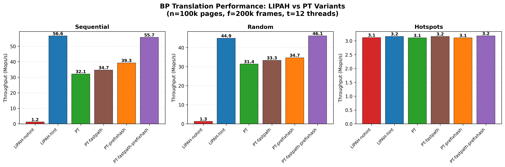

# Buffer Pool Variants: LIPAH, PT

A visual comparison of the three buffer-pool translation strategies.

The core question for any BP: given a `PageKey = (container, page_id)`, **how
do you find the frame that holds it?** Each variant answers differently.

```
                ┌──────────────┐
                │   PageKey    │   "I want page (c=9, p=12345)"
                └──────┬───────┘
                       │
                       ▼
                  translation
                       │
                       ▼
                ┌──────────────┐
                │  frame_id    │   "It's in frame 4321"
                └──────────────┘
```

The differentiator: **where the `frame_id` hint comes from** and what happens
when the hint is stale.

---

## 1. LIPAH — keep (page_id, frame_id) together

The upper layer (B-tree or any access method) stores `PageFrameKey =
(page_id, frame_id)` pairs — both fields kept side by side. The page_id is
always authoritative; the frame_id is a cached hint into the BP. The hint
comes "for free" because the calling code already has it loaded.

```
┌───────────────────────────────────────────────────────────────┐
│  B-tree internal node                                         │
│ ┌─────────────────────────────────────────────────────────┐   │
│ │ key0 │ key1 │ key2 │ key3 │ ...                         │   │
│ ├─────────────────────────────────────────────────────────┤   │
│ │ Each slot: PageFrameKey = (page_id, frame_id_hint)      │   │
│ │  ┌──────────┬──────────┐  ┌──────────┬──────────┐  ...  │   │
│ │  │ page_id  │ frame_id │  │ page_id  │ frame_id │       │   │
│ │  │   123    │   4321   │  │   124    │    982   │       │   │
│ │  └──────────┴──────────┘  └──────────┴──────────┘       │   │
│ └────┬─────────────────┬──────────────────────────────────┘   │
└──────┼─────────────────┼──────────────────────────────────────┘
       │ page_id         │ frame_id_hint  (kept alongside)
       │ (authoritative) │
       │                 ▼
       │      ┌────────────────────────────────────────────┐
       │      │  Global Frame Array  (validates the hint)  │
       │      │  ┌────┬────┬────┬────┬────┬────┬────┬───┐  │
       │      │  │meta│meta│meta│meta│meta│meta│meta│...│  │
       │      │  └────┴────┴────┴────┴────┴────┴────┴───┘  │
       │      │                  ▲                         │
       │      │              frame[hint]                   │
       │      └────────────────────────────────────────────┘
       │                          │
       │                          ▼
       └────────────────▶ meta.key == page_id?
                                  │
                        ┌─────────┴─────────┐
                       YES                  NO  (hint stale)
                        │                    │
                   ┌─────────┐         ┌──────────────────────┐
                   │ FAST    │         │  SLOW PATH           │
                   │ PATH    │         │  DashMap.get(page_id)│
                   │         │         │     │                │
                   │ no      │         │     ▼                │
                   │ extra   │         │  fresh frame_id      │
                   │ work    │         │     │                │
                   │         │         │     ▼                │
                   └─────────┘         │  caller updates the  │
                                       │  frame_id field of   │
                                       │  its PageFrameKey    │
                                       └──────────────────────┘
```

**Key idea**: translation work is *zero* on the fast path — the hint is
already next to the page_id in the caller's data. After eviction, one
DashMap lookup gives a fresh frame_id; the caller writes it back into its
own `PageFrameKey` so subsequent accesses are fast again.

---

## 2. PT — Predictive Translation (from PrediCache → PT-FP-1)

PT *computes* the hint from the page key by a hash — no swizzling, no
cache to warm. The sections below trace how we arrive at PT-FP-1 from the
original PrediCache design, because each change is motivated by a specific
limitation of the original.

### 2.1 The original PrediCache design

PrediCache (Leis et al.) collapses the translation HT and the frame metadata
into a single structure. The HT is an array of `BufferFrame`s — there is no
separate "frame table." A bucket's position in the array **is** its identity;
no `page_id` is stored anywhere.

The crucial property: the **same hashed index** names both the HT bucket
*and* the page, so the two loads can be issued in parallel — the HT load
and the page load fly at the same time, and the CPU waits on whichever
comes back last.

```
                    pid (page id)
                       │
                       ▼
                 idx = hash(pid) % N  ──────────────────────────────────┐
                       │                                                │
                       │ (load HT bucket)              (load page,      │
                       │                                in parallel)    │
                       ▼                                                │
┌──── HashTable of BufferFrames (size N) ──────────────┐                │
│                                                      │                │
│   idx:   0      1      2    ...   idx   ...   N-1    │                │
│        ┌────┐ ┌────┐ ┌────┐     ┌══════╗    ┌────┐   │                │
│        │ BF │ │ BF │ │ BF │ ... ║  BF  ║ .. │ BF │   │                │
│        │lock│ │lock│ │lock│     ║ lock ║    │lock│   │                │
│        │iSl │ │iSl │ │iSl │     ║ iSl  ║    │iSl │   │                │
│        │page│ │page│ │page│     ║ page ║    │page│   │                │
│        │ *  │ │ *  │ │ *  │     ║  *   ║    │ *  │   │                │
│        └─┬──┘ └─┬──┘ └─┬──┘     └══╤═══╝    └─┬──┘   │                │
└──────────┼──────┼──────┼───────────┼──────────┼──────┘                │
           ▼      ▼      ▼           ▼          ▼                       │
        ┌─────┐┌─────┐┌─────┐    ┌═══════╗  ┌─────┐                     │
        │16KB ││16KB ││16KB │... ║ 16KB  ║  │16KB │                     │
        │page ││page ││page │    ║ page  ║  │page │                     │
        └─────┘└─────┘└─────┘    ╚═══▲═══╝  └─────┘                     │
                                     │                                  │
                                     └──────────────────────────────────┘

                             predicted page at column idx —
                             verified by: lock version stable
                                          AND iSl (intendedSlot) == 1

   legend:  BF  = BufferFrame (bucket + frame metadata fused)
            lock = PageState lock / version counter
            iSl  = intendedSlot flag ("a page is really parked here")
            page*= pointer to the 16 KB page bytes
```

Predicted frame = `hash(pid) % num_frames`. If the page is resident, it is
*expected* to live at that HT slot. The `intendedSlot` flag and the version
bits jointly confirm "yes, this is your page, nobody mid-wrote it." Because
the bucket, the frame, and the scan target are the same object, every
operation — lookup, validate, evict — goes through the HT.

### 2.2 Four limitations of the original design

**L1. Fused HT + frame metadata — good for access, bad for eviction scans.**

Putting the frame metadata inside the HT bucket is *attractive* on the hit
path: a single cache line carries the lock, the `intendedSlot` flag, and
the page pointer, so validation and dereference share one memory access.
But the clock/second-chance eviction scanner must now walk the HT instead
of a flat frame array. With overflow chains and sparsely occupied buckets,
every tick of the scan is a chased pointer on cold memory.

```
   eviction scan in PrediCache:

      HT[0] ─▶ HT[1] ─▶ [overflow] ─▶ HT[2] ─▶ HT[3] ─▶ [overflow chain]
        │                │              │        │
       empty?           set?          empty?    set?   ← each tick:
                                                         chase pointer,
                                                         miss cache
```

**L2. Every access pays an HT lookup — cheap validation is impossible.**

L2 is the flip side of L1: because the page's identity is encoded only by
its HT *position* plus the `intendedSlot` bit, validation *must* ride the
HT bucket. There is no way to ask "is this really page P?" without first
loading the HT line. If frame metadata instead lived in a contiguous array
indexed by `frame_id`, a hit could be validated with one indexed read —
`frames[i].page_key == pid` — no hash table touch at all.

**L3. Full-PID hash scatters sequential scans.**

Postgres page IDs are 8 bytes with natural structure:

```
┌──────────────────── PageID (64 bits) ────────────────────┐
│  upper 4 bytes: RelFileNode  │  lower 4 bytes: BlockNum  │
│  (relation / fork / db file) │  (sequential within file) │
└──────────────────────────────┴───────────────────────────┘
               ▲                             ▲
               │                             │
        "which table/index"         "which page inside it"
        — changes slowly             — 0,1,2,3,... on scans
```

A regular hash of the whole 8-byte key destroys the lower-32-bit structure:
block 0 and block 1 of the same relation land in unrelated HT buckets.
Sequential scans, a common Postgres access pattern, thrash the buffer pool
and defeat the hardware prefetcher.

**L4. Collisions cost a 16 KB page copy (promotion / demotion).**

Because "the page lives at `hash(pid) % N`" is treated as an invariant,
when two pages hash to the same slot the resident one must be pushed
aside (demoted into overflow) and the incoming one copied in (promoted
to its predicted slot). Every such collision is a full **16 KB memcpy**
— not a pointer swing:

```
   pid_A and pid_B both hash to slot s
   ─────────────────────────────────────

       before                       after access to pid_B

    slot s: ┌──────────┐          slot s: ┌──────────┐
            │  pid_A   │                  │  pid_B   │   ← promoted
            │  16 KB   │                  │  16 KB   │     (16 KB copy in)
            └──────────┘                  └──────────┘

   overflow:  (empty)             overflow: ┌──────────┐
                                            │  pid_A   │   ← demoted
                                            │  16 KB   │     (16 KB copy out)
                                            └──────────┘
```

Under even mild hot-set contention, promotion/demotion churn dominates —
each "miss" is a cache-unfriendly 16 KB copy plus the overflow lookup
itself. Worse, a hot pair of colliding pages can ping-pong: A displaces
B, next access to B displaces A, and so on, with 32 KB of copy traffic
per round trip.

### 2.3 Enhancements

**E1. Split HT from frame metadata; simulate parallel access by prefetching.**
*(addresses L1)*

PT keeps the **hash table as a separate structure**, but its buckets no
longer embed the frame — they just store a **frame index**:
`HT[bucket] → frame_idx`. Frame metadata moves to a separate flat array
`frames[]` (holding just the page key and the lock — no page pointer is
needed, because the page at index `i` always lives at
`page_base + i * 16 KB`). Pages are contiguous storage, one slot per
frame. Taking the original PrediCache diagram and redrawing it with this
three-way split:

```
                       pid (page id)
                           │
                           ▼
                   pred = hash(pid) % N
                           │
      ┌────────────────────┘    (all three accesses issued in parallel —
      │                          all addresses come from `pred`)
      │
      ├──── LOAD HT[pred] ─────────────┐
      │                                │
      │                                ▼
      │   HashTable  (now maps pid → frame_idx):
      │       bucket: 0     1     2   ...  pred   ...   N-1
      │              ┌────┐┌────┐┌────┐   ┌══════╗    ┌────┐
      │              │f=2 ││f=7 ││f=5 │.. ║ f_i  ║ .. │f=9 │
      │              └────┘└────┘└────┘   ╚══════╝    └────┘
      │
      ├──── PREFETCH frames[pred] ─────┐
      │                                │
      │                                ▼
      │   frames[]  (flat frame metadata, separate — no page*):
      │        idx:  0     1     2   ...  pred   ...   N-1
      │              ┌────┐┌────┐┌────┐   ┌══════╗    ┌────┐
      │              │key ││key ││key │.. ║ key  ║ .. │key │
      │              │lock││lock││lock│   ║ lock ║    │lock│
      │              └────┘└────┘└────┘   ╚══════╝    └────┘
      │
      └──── PREFETCH page[pred] ───────┐
                                       │
                                       ▼
          pages[]  (one 16 KB page per slot — page[i] at page_base + i·16KB):
               idx:  0     1     2   ...  pred   ...   N-1
                    ┌────┐┌────┐┌────┐   ┌══════╗    ┌────┐
                    │16KB││16KB││16KB│.. ║ 16KB ║ .. │16KB│
                    │page││page││page│   ║ page ║    │page│
                    └────┘└────┘└────┘   ╚══════╝    └────┘
```

- **L1 fixed**: the eviction scanner walks `frames[]` linearly
  (`i = (i+1) % N`, inspect `frames[i]`) — no HT walk, no overflow chains.
- **Parallelism preserved**: the fused PrediCache design got its speed
  from issuing the HT load and the page load together. With the split,
  a naive implementation would serialize (HT → frame_idx → frames[idx] →
  page). We recover the parallelism by **prefetching both `frames[pred]`
  and `page[pred]` while the HT load is still in flight** — all three
  memory requests are running concurrently, so the split layout simulates
  the fused design's parallel access in software.

So the decoupled layout keeps the original's "two loads at once"
behavior — not by structural fusion, but by software prefetch from the
predicted slot *before* we even know whether we'll need the HT.

**E2. Prefix-hash, suffix-offset.** *(addresses L3)*

PT splits the hash along the natural Postgres PID boundary:

```
  base = hash(RelFileNode)            ← one relation → one base region
  slot = (base + BlockNumber) % N     ← sequential blocks → sequential slots
```

Sequential scans now land in sequential frames — the hardware prefetcher
handles them for free, and pages of one relation stay clustered in the
buffer pool.

```
   table A  (RelFileNode = 42)           table B  (RelFileNode = 99)
   ┌──┐┌──┐┌──┐┌──┐┌──┐                  ┌──┐┌──┐┌──┐┌──┐
   │b0││b1││b2││b3││b4│                  │b0││b1││b2││b3│
   └┬─┘└┬─┘└┬─┘└┬─┘└┬─┘                  └┬─┘└┬─┘└┬─┘└┬─┘
    │   │   │   │   │                     │   │   │   │
    ▼   ▼   ▼   ▼   ▼                     ▼   ▼   ▼   ▼
  ┌───────────────────────── frames[] ─────────────────────────┐
  │..│A0│A1│A2│A3│A4│.....................│B0│B1│B2│B3│........│
  └────────────────────────────────────────────────────────────┘
     ↑                                     ↑
     base_A = hash(42)                     base_B = hash(99)
```

This is essentially software TLB-style prefetch on the translation side,
plus a page-header touch to hide the second miss.

### 2.6 One more step — validate with `page_key`, skip the HT on a hit

E1 already has us **prefetching `frames[pred]` and `page[pred]` in
parallel**. When the frame metadata line arrives, we don't treat it as
pure latency-hiding — we *use* it. Because each frame now stores its own
`page_key`, a single indexed compare at the predicted slot tells us
whether the prediction was right. If it matches, we're done — and
crucially **the HT load is never issued at all**.

Reusing the E1 branch diagram, `LOAD HT[pred]` moves out of the
always-on parallel fan-out and becomes conditional on the validation
failing:

```
   pred = hash(pid) % N
      │
      ├──── PREFETCH frames[pred] ────▶ frames[pred].page_key == pid ?
      │                                          │
      │                                    ┌─────┴─────┐
      └──── PREFETCH page[pred] (warmed)  YES         NO
                                           │           │
                                     return page    LOAD HT[pred]
                                     (HT never         │
                                      issued)          ▼
                                                  actual frame_idx
                                                  → frames[idx], page[idx]
```

- **Hit** (common case): `page_key == pid` → return `page[pred]`.
  No HT load is ever dispatched — not issued, not in flight, not
  consuming MSHRs.
- **Miss** (displaced into overflow): *only now* do we issue
  `LOAD HT[pred]` to find the real frame index, then redo the frame and
  page loads at that index.

So the HT is demoted from critical-path locator to a fallback structure
that the common path never touches. Compared to PrediCache's
`intendedSlot` bit (which can only say "something is here"), the full
`page_key` lets us confirm identity *and* elide the HT load entirely on
a hit.

### 2.7 PT-FP-1 — final access path

```
PageKey
   │
   ├─ split ─▶ base = hash(RelFileNode)
   │          slot = (base + BlockNumber) % N
   │            │
   │            ├── PREFETCH &frames[slot]
   │            └── PREFETCH  page_base + slot*16KB
   │                     │
   │                     ▼
   │   ┌──────────────────────────────────────────────────────────┐
   │   │  frames[]  (flat, contiguous, cache-aligned)             │
   │   │  ┌────┬────┬────┬────┬────┬────┬────┬────┬────┬────┐    │
   │   │  │meta│meta│meta│meta│meta│meta│meta│meta│meta│... │    │
   │   │  └────┴────┴────┴────┴────┴────┴────┴────┴────┴────┘    │
   │   │                    ▲                                     │
   │   │              frames[slot]                                │
   │   └──────────────────────────────────────────────────────────┘
   │                        │
   │                        ▼
   └──────────▶   frames[slot].page_key == PageKey ?
                            │
                   ┌────────┴────────┐
                  YES                NO  (displaced → overflow)
                   │                  │
             ┌──────────┐     ┌────────────────────────────────────┐
             │ FAST     │     │  SLOW PATH                         │
             │ PATH     │     │  ┌──────────────────────────────┐  │
             │          │     │  │ Overflow Hash Table (chained)│  │
             │ 0 HT     │     │  └──────────────┬───────────────┘  │
             │ access   │     │                 ▼                  │
             │ ≈ 1 miss │     │           frame_id                 │
             │ (hidden  │     │                 ▼                  │
             │  by pref)│     │      page_key validation           │
             └──────────┘     │                 ▼                  │
                              │     ┌───────────────────────────┐  │
                              │     │ promote? (1/50 or 1/512)  │  │
                              │     │ → COPY 16 KB page back    │  │
                              │     │   into preferred frame    │  │
                              │     └───────────────────────────┘  │
                              └────────────────────────────────────┘
```

**Key idea**: access methods store only `page_id` (so any index works
unchanged), but the fast path pays no HT lookup, no lock-version walk on
the HT bucket, and hides its one remaining miss behind a prefetch. Misses
cost an overflow lookup + occasional 16 KB copy on promotion.

### 2.8 The fundamental weakness PT cannot fix — page copies on collision

E1, E2, and validation-via-`page_key` handle L1, L2, and L3. **L4 is
different**: it is not a layout or a hash-function choice, it is a direct
consequence of the prediction *invariant* — "page P lives at
`hash(P) % N`". Enforcing that invariant in the face of a hash collision
means physically *moving* 16 KB pages between slots, not updating
pointers.

Concretely, when `pid_A` and `pid_B` hash to the same slot `s` and both
need to be resident, PT must **swap them** — which is three 16 KB
memcpys:

```
   before:    slot s  =  [ pid_A  16 KB ]       overflow o = [ pid_B  16 KB ]


   step 1:    COPY slot s   → temp         (save the evictee)         16 KB
              ┌──────────┐     ┌──────────┐
              │  pid_A   │ ──▶ │  pid_A   │        temp holds A
              └──────────┘     └──────────┘

   step 2:    COPY overflow → slot s       (promote pid_B to prediction) 16 KB
              ┌──────────┐     ┌──────────┐
              │  pid_B   │ ──▶ │  pid_B   │        slot s now holds B
              └──────────┘     └──────────┘

   step 3:    COPY temp     → overflow     (demote pid_A)              16 KB
              ┌──────────┐     ┌──────────┐
              │  pid_A   │ ──▶ │  pid_A   │        overflow now holds A
              └──────────┘     └──────────┘


   after:     slot s  =  [ pid_B  16 KB ]       overflow o = [ pid_A  16 KB ]

                                                           total: 48 KB copied
```

Why this is fundamental:

- **No hashing scheme fixes the *cost***. Uniform hashing, two-choice,
  cuckoo — all reduce the *probability* of a collision, but the *cost
  per collision* is still at least one 16 KB memcpy (and up to three for
  a swap).
- **Hot colliding pairs ping-pong**. A working set that contains even
  one colliding pair pays the full swap on *every* alternation —
  48 KB of pure memory-bandwidth traffic per round trip, serialized on
  the thread doing the access.
- **Not hideable by prefetch**. The copies are stores, not loads, and
  each step depends on the previous — this is on the critical path.

The natural next step — letting the buffer manager place pages wherever
it likes and caching the resolved `(pid → frame_id)` translation per
thread, so that a collision becomes a cheap pointer lookup instead of a
16 KB copy — is covered separately in [tlb_bp.md](tlb_bp.md).

---

## 3. Where the hint lives — the central distinction

```
              hint source         hint cost                hint update
              ──────────────      ──────────────           ─────────────
LIPAH         PageFrameKey        0 (already in            on slow lookup,
              field next to       caller's data)           caller writes
              page_id                                      fresh frame_id
              (kept together)                              into its own
                                                          PageFrameKey

PT-FP-1       hash function       ~5 cycles compute        never (fixed
              (computed)                                   by hash function;
                                                          page can be
                                                          promoted/demoted
                                                          via copy)
```

---

## 4. Benchmark results


